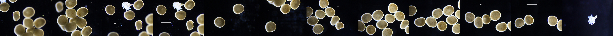
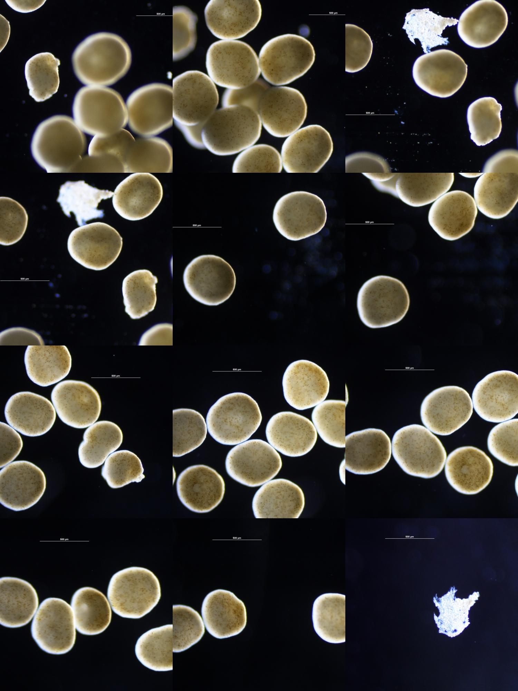

### Hi there 👋

I'm a grad student researcher exploring microbiome, differential gene expression, and physiology of corals in relationship to plastic pollution and heat stress.
You can check out what I'm currently working on [here](https://sarahtanja.github.io/quarto-blog/) in my open-lab notebook.

### Coral Embryo Art 🪸

Here are some beautiful microscopy images from my coral embryo research:

  

  

  

<!--
**sarahtanja/sarahtanja** is a ✨ _special_ ✨ repository because its `README.md` (this file) appears on your GitHub profile.

Here are some ideas to get you started:

- 🔭 I’m currently working on ...
- 🌱 I’m currently learning ...
- 👯 I’m looking to collaborate on ...
- 🤔 I’m looking for help with ...
- 💬 Ask me about ...
- 📫 How to reach me: stanja@uw.edu(
- 😄 Pronouns: ...
- ⚡ Fun fact: ...
-->
